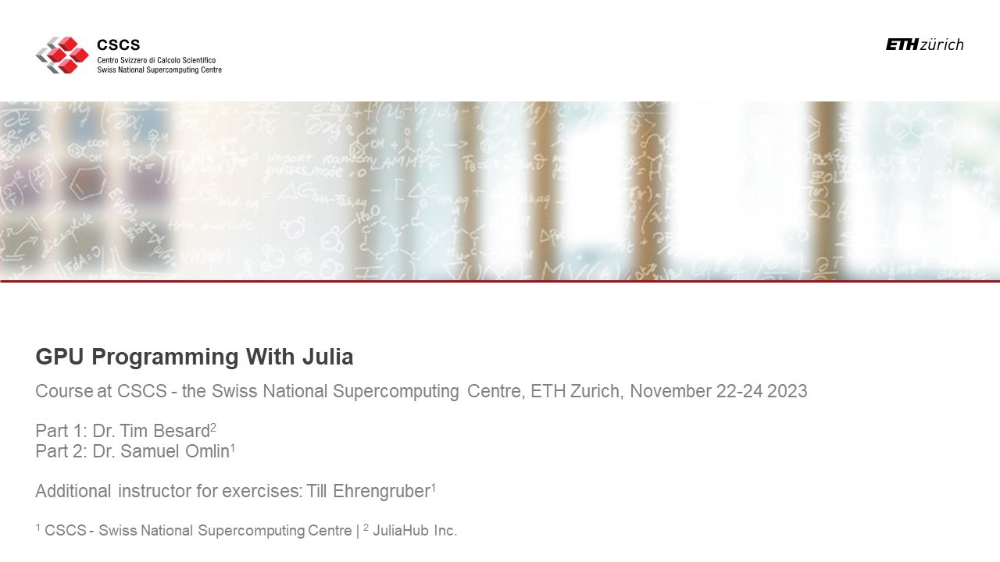

#### Course Description

The programming language Julia is being more and more adopted in High Performance Computing (HPC) due to its unique way to combine performance with simplicity and interactivity, enabling unprecedented productivity in HPC development. This course will discuss both basic and advanced topics relevant for single and Multi-GPU computing with Julia. It will focus on the CUDA.jl package, which enables writing native Julia code for GPUs. Topics covered include the following:

-    GPU array programming;
-    GPU kernel programming;
-    kernel launch parameters;
-    usage of on-chip memory;
-    Multi-GPU computing;
-    code reflection and introspection; and
-    diverse advanced optimization techniques.

This course combines lectures and hands-on sessions.

#### Target audience

This course addresses scientists interested in developing HPC applications using Julia. Previous Julia or GPU computing knowledge is not mandatory, but advantageous, and a good general understanding of programming is expected. 

#### Instructors

- Dr. Tim Besard (Creator and Lead developer of CUDA.jl, JuliaHub Inc.)
- Dr. Samuel Omlin (Computational Scientist | Responsible for Julia computing, CSCS)

#### Course material

This git repository contains the material for the part 2 of the course (speaker: Dr. Samuel Omlin, CSCS). The material for the part 1 is found in [this git repository](https://github.com/maleadt/cscs2023) (speaker: Dr. Tim Besard, JuliaHub Inc.).

#### Edited course recording

The edited course recording is found [here](https://youtu.be/plgbsH9f7gI?si=YUNaaOSE6wBQazcm) (part 1) and [here](https://youtu.be/Emr9gfcQr9A?si=-jXy-Hb2apwtggAp) (part 1). The following list provides key entry points into the videos.

Part 1

[00:00: Introduction to the course](https://youtu.be/plgbsH9f7gI?si=YUNaaOSE6wBQazcm)

[03:23: Introduction to part 1](https://youtu.be/plgbsH9f7gI?si=JzXyZHY-udQ3-5ZD&t=203)

[04:59: Presentation of notebook 1-0: Introduction](https://youtu.be/plgbsH9f7gI?si=XuBcHLZrKfFpC_Na&t=299)

[24:19: Presentation of notebook 1-1: Array programming](https://youtu.be/plgbsH9f7gI?si=MP0pLCqq7Jf13O_5&t=1459)

[43:18: Presentation of notebook 1-2: Application analysis and optimization](https://youtu.be/plgbsH9f7gI?si=vdtLUUXddL0FN34y&t=2598)

[1:33:22: Presentation of notebook 1-3: Kernel programming](https://youtu.be/plgbsH9f7gI?si=JRK3kvNFy4KJZC8G&t=5602)

[2:25:23: Presentation of notebook 1-4: Kernel analysis and optimization](https://youtu.be/plgbsH9f7gI?si=lBBzvY0bKXakUIkU&t=8723)

[3:19:16: Presentation of notebook 2-1: CUDA libraries](https://youtu.be/plgbsH9f7gI?si=ir5GzmM9MRE_aaNi&t=11956)

[3:41:08: Presentation of notebook 2-2: Memory management](https://youtu.be/plgbsH9f7gI?si=LkD7WoJEYSBTQbUf&t=13268)

[4:03:44: Presentation of notebook 2-3: Concurrent computing](https://youtu.be/plgbsH9f7gI?si=AX5FcofuGUqf-rid&t=14624)

Part 2

[00:51: High-speed introduction/thoughts on GPU supercomputing](https://youtu.be/Emr9gfcQr9A?si=AwtBlt7cb4Uuit2e&t=51)

[08:38: Overview on course notebooks of part 1](https://youtu.be/Emr9gfcQr9A?si=YsxejpyKZYAWlUfL&t=518)

[11:08: Presentation of notebook 1: Memory copy and performance evaluation](https://youtu.be/Emr9gfcQr9A?si=n4z56b09HFlKTQA5&t=668)

[43:59: Walk through solutions of notebook 2: Application performance evaluation and optimization](https://youtu.be/Emr9gfcQr9A?si=Ko91K4nlGcy0qELv&t=2639)

[58:29: Presentation on sustainable HPC building block development in Julia](https://youtu.be/Emr9gfcQr9A?si=_xnMqMIko_Qc3s5q&t=3509)

[1:27:56: Walk through solutions of notebook 3: Using shared memory](https://youtu.be/Emr9gfcQr9A?si=YGaNXnnUeDQ1ope0&t=5276)

[1:37:35: Walk through solutions of notebook 4: Steering registers and using warp level functions](https://youtu.be/Emr9gfcQr9A?si=QvxhkYCk5HDL4mtF&t=5855)

[1:57:02: Walk through solutions of notebook 5: Distributed parallelization](https://youtu.be/Emr9gfcQr9A?si=4v9cIjqWjSlVez3j&t=7022)
